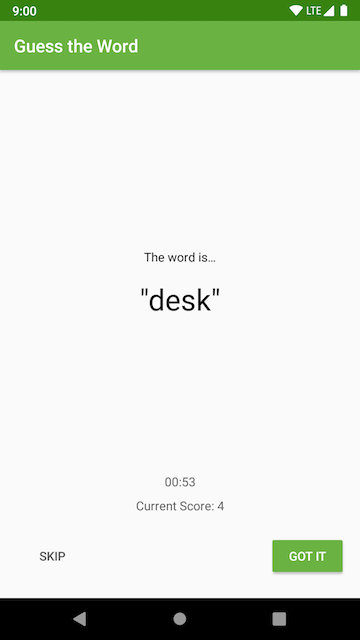

# Arquitetura de aplicação - Camada de interface do usuário (UI Layer)!
Este é um aplicativo que foi desenvolvido no quinto módulo do curso [Android App Development in Kotlin - Udacity](https://www.udacity.com/course/developing-android-apps-with-kotlin--ud9012).

## Guess It!

Guess It é um jogo de adivinhação de palavras que pode ser jogado em duas ou mais pessoas. 
Para jogar, coloque o dispositivo em modo paisagem, virado contra você e com os dedos posicionados nos botões **Skip** e **Got It**.
Seus amigos darão dicas para você tentar adivinhar as palavras

Se acertar a palavra, pressione **Got It**. Se você não conseguir adivinhar, pressione **Skip** para pular para próxima palavra.
O jogo termina após 1 minuto.

## Screenshots

  

